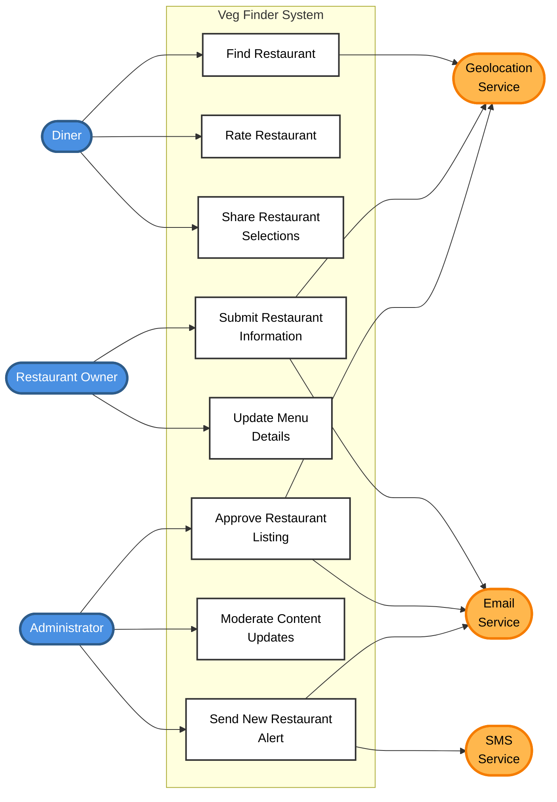

# Veg Finder - Use Cases

## Primary Actors:
- Diners (users with dietary preferences/restrictions)
- Restaurant Owners
- Administrators

## Use Cases:
- Find Restaurant
- Rate Restaurant
- Share Restaurant Selections
- Submit Restaurant Information
- Update Menu Details
- Approve Restaurant Listing
- Moderate Content Updates
- Send New Restaurant Alert

## Secondary Actors:
- Email Service
- SMS Service
- Geolocation Service

---

## Use Case Narrative: Find Restaurant

### Use Case Name
Find Restaurant

### Primary Actor
Diner

### Goal
The diner successfully finds a restaurant that matches their dietary needs and current dining context.

### Preconditions
- The system contains approved restaurant listings.
- Restaurant information is current and validated.

### Main Success Scenario
1. The diner specifies their dietary preference (vegetarian, vegan, gluten-free, etc.).
2. The diner indicates their current context (eating now vs. planning ahead, location preference, dining alone vs. with group).
3. The system uses Geolocation Service to determine the diner's current location.
4. The diner optionally adds filters (price range, food type, open now, specific cuisine).
5. The system retrieves matching restaurants from the database.
6. The system ranks results based on the diner's personal ratings and preferences.
7. The system displays a compact list of recommended restaurants with key details.
8. The diner selects a restaurant to view full details.
9. The system provides complete information including menu, hours, location, and contact details.

### Extensions (Alternative Flows)
- 3a. Geolocation Service unavailable:
    - The system prompts the diner to manually enter their location or area preference.
- 3b. Diner denies location permission:
    - The system asks the diner to specify their preferred dining area manually.
- 5a. No restaurants match all criteria:
    - The system suggests relaxing specific filters and shows near-matches.
- 5b. Diner is in unfamiliar area:
    - The system provides additional guidance and descriptions for local establishments.
- 6a. Diner has no personal ratings yet:
    - The system ranks by general ratings from similar users or defaults to popular choices.
- 7a. Selected restaurant is currently closed:
    - The system highlights closure and suggests alternative times or similar open restaurants.

### Postconditions
- The diner has identified a suitable restaurant.
- The diner's search preferences are saved for future personalization.

---

## Use Case Narrative: Submit Restaurant Information

### Use Case Name
Submit Restaurant Information

### Primary Actor
Restaurant Owner

### Goal
The restaurant owner successfully submits their restaurant information for inclusion in the system.

### Preconditions
- The restaurant owner has registered an account.
- The restaurant serves options for specialty diets.

### Main Success Scenario
1. The restaurant owner enters basic restaurant details (name, address, phone, website).
2. The system validates the address using Geolocation Service.
3. The restaurant owner specifies dietary options offered (vegetarian, vegan, gluten-free, etc.).
4. The restaurant owner uploads menu information and photos.
5. The restaurant owner sets operating hours and days.
6. The restaurant owner adds special features (takeout, dine-in, outdoor seating, etc.).
7. The restaurant owner submits the information for review.
8. The system notifies the Administrator via Email Service.
9. The system provides submission confirmation to the restaurant owner.

### Extensions (Alternative Flows)
- 2a. Address cannot be validated:
    - The system prompts the restaurant owner to verify and correct the address.
- 2b. Geolocation Service unavailable:
    - The system accepts the address and flags it for manual verification by Administrator.
- 4a. Photos exceed size limit:
    - The system notifies the restaurant owner and suggests compressing images.
- 8a. Email Service unavailable:
    - The system queues the notification for later delivery and logs the pending review.

### Postconditions
- The restaurant information is stored as "pending approval" in the system.
- The Administrator is notified of the submission pending review.

---

## Use Case Narrative: Approve Restaurant Listing

### Use Case Name
Approve Restaurant Listing

### Primary Actor
Administrator

### Goal
The administrator successfully reviews and approves a restaurant listing for public visibility.

### Preconditions
- A restaurant owner has submitted restaurant information.
- The administrator is logged into the system.

### Main Success Scenario
1. The administrator views the list of pending restaurant submissions.
2. The administrator selects a submission to review.
3. The system displays all submitted restaurant details, menu, and photos.
4. The administrator verifies the information accuracy and appropriateness.
5. The administrator verifies location using Geolocation Service.
6. The administrator approves the listing.
7. The system publishes the restaurant to the public database.
8. The system notifies the restaurant owner of approval via Email Service.

### Extensions (Alternative Flows)
- 4a. Information is incomplete or inaccurate:
    - The administrator rejects the submission with notes.
    - The system notifies the restaurant owner via Email Service with required changes.
- 4b. Restaurant does not meet dietary criteria:
    - The administrator rejects the submission with explanation.
    - The system notifies the restaurant owner via Email Service.
- 5a. Geolocation Service unavailable:
    - The administrator manually verifies the location or postpones approval.
- 8a. Email Service unavailable:
    - The system queues the notification and displays in-app message to restaurant owner.

### Postconditions
- The restaurant listing is either approved and publicly visible, or rejected with feedback.
- The restaurant owner is notified of the decision.
