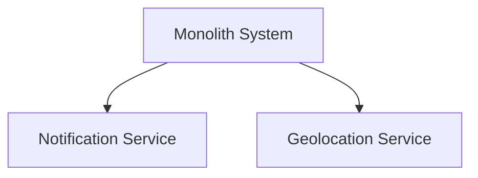

# System Structure

## System Architecture Style

**Monolith**

The system follows a monolithic architecture where all components are built and deployed as a single unified application.

## System Architecture Diagram

The monolith system depends on two external systems:
- **Notification Service**: For sending email or SMS communications
- **Geolocation Service**: For location-based functionality

## Tech Stack

### Programming Language
- **TypeScript**: Primary programming language for both frontend and backend

### Database
- **MongoDB**: NoSQL database for data persistence

### Frameworks & Libraries
- **Express**: Backend API
- **React**: Frontend UI framework
- **Vitest**: Testing framework for unit and integration tests
- **Playwright**: End-to-end testing framework

## Repository Strategy

**Mono-Repo**

A single repository contains all system components including:
- Backend application
- Frontend application
- Tests
- Documentation